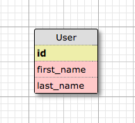
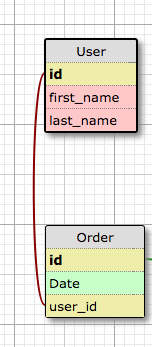
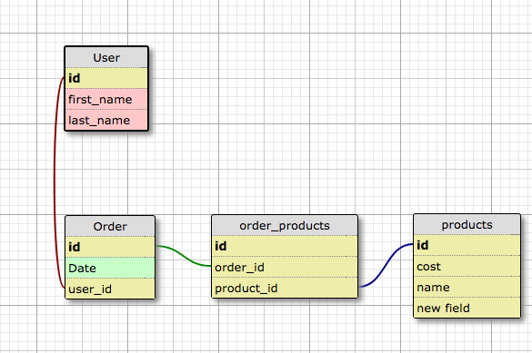
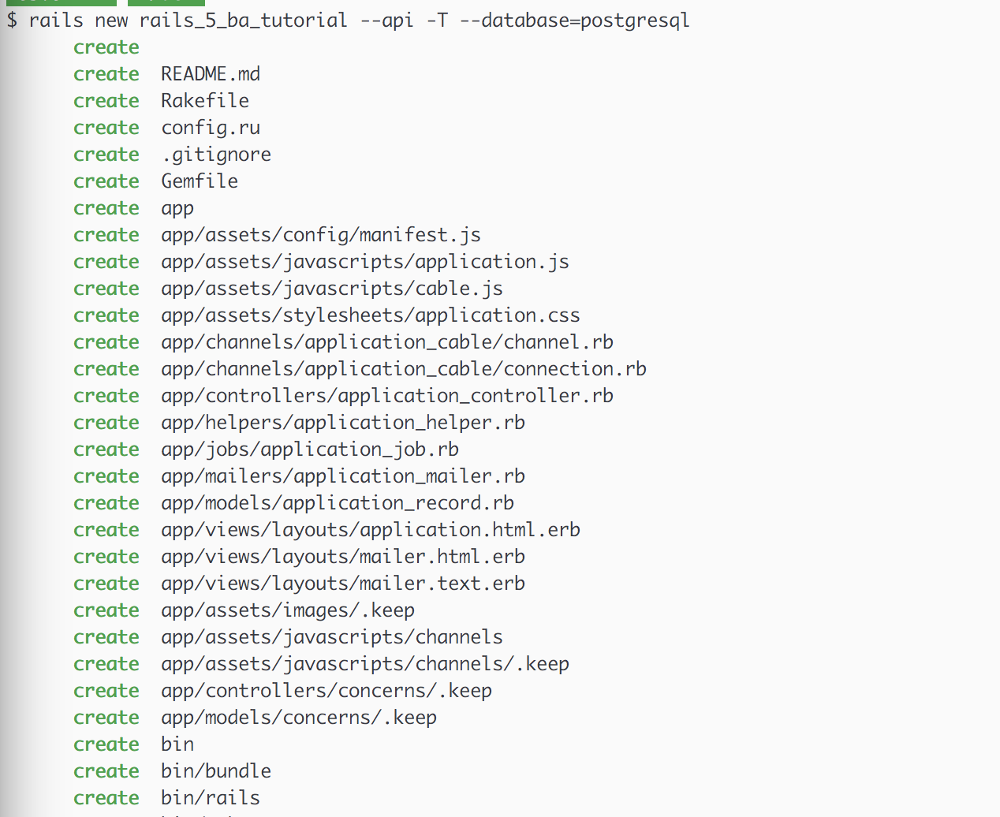

# Data modeling

### Setup

- `git clone` this repo (`git clone git@github.com:blueapron/Rails-api-and-react-tutorial.git`)
and switch to branch: `git checkout 2_data_setup`

The state of the application is a newly created Rails API

### What are we going to build?

Say our product manager and tech lead have determined that we need to build a new
Rails API that can store information about a user's orders and an order's
products. These are the requirements:

- Create a new user
- Create new orders for a user
- See a user's orders
- See an order's products

### General overview

1. Plan our data model (i.e., how our data is going to be stored and
  associated with each other). This will involve creating database migrations
  and Rails models to interact with the database. This is the 'M' in MVC.
2. Create Routes and Controllers to access the data via HTTP. We will create
an endpoint to create a user, create a new order for a user, see a user's orders,
and see an order's products. This is the 'C' in MVC.
3. Create serializers to serialize the data into JSON so that it can be
transmitted over the network to a consuming client side application. This enables
the 'C' in MVC.
4. We have no 'V' or views in the traditional MVC, at least not on the Rails
server side of things. Since we're building a Rails API, our application does
not need to render Views, just the JSON for a client-side application to use.

### Data modeling, ERDs, and You!

So, what will our data model look like? Let's conceptualize it first in an
[ERD](https://www.techopedia.com/definition/1200/entity-relationship-diagram-erd)
before actually creating tables in our database.

We first need to create a `User` and let's say this user has a `first_name` and
`last_name`. Our `User` table will look like this:



But our user also needs to have many orders. Let's adapt our schema concept:



So, we conceptualized the relationship between users and orders as follows: A
user can have many orders and an order can belong to a single user. The `user_id`
field on the orders table is a [foreign key](https://en.wikipedia.org/wiki/Foreign_key)
which corresponds to a primary key on the `User` table. If `user_id` on the Orders
table is equal to 1, that means that the order is associated to a user in the
`User` table with a primary key of 1.

Finally, let's add the relationship between orders and products:



We created a joined table between the `Order` and `Product` table. Why? That's
the only way we can express a many-to-many association with another model in a
relational database. We want an order to have many products and for products
to have many orders (i.e., a ramen Product can be in many orders). Since the
association is created using a foreign key, we need another table to store the
foreign keys of both tables. If we simply put an `order_id` on the `Product`
table, it wouldn't be possible for a Product (represented by a row of data in the
`Product` table) to be associated with several orders; it could only be associated
with the single order referenced by the row's `order_id` foreign key.


### Setup Rails. Add a couple gems:

Before we create our database tables and Rails models, let's configure Rails to
use a few external libraries.

- [rspec-rails](https://github.com/rspec/rspec-rails) - Testing framework.
- [factory_girl_rails](https://github.com/thoughtbot/factory_girl_rails) - A fixtures
replacement with a more straightforward syntax. You'll see.
- [database_cleaner](https://github.com/DatabaseCleaner/database_cleaner) - You
guessed it! It literally cleans our test database to ensure a clean state in
each test suite.
- [faker](https://github.com/stympy/faker) - A library for generating fake data.
We'll use this to generate test data.
- [pry-rails](https://github.com/rweng/pry-rails) - Debugger. We're going to replace
`byebug` which comes standard with new Rails applications.

We're going to add these gems to our folder's [`Gemfile`](http://tosbourn.com/what-is-the-gemfile/)

Add `factory_girl_rails`, `pry-rails`, and `faker` to the `group :development, :test` section
of your Gemfile while adding `rspec-rails` and `database_cleaner` to the `:test` group
section.

We'll also add the `ActiveModelSerializer` and `JSON-api` gems so that we can
serialize our model data into JSON later on. We don't need them right now when
generating models, but we'll add these gems to the top-level of our `Gemfile`
for later use.

So our `Gemfile` will look like this:

```rails
gem 'rails', '~> 5.0.3'
gem 'pg', '~> 0.18'
gem 'puma', '~> 3.0'
gem 'active_model_serializers', '~> 0.10.0'
gem 'jsonapi-resources'

group :development, :test do
  gem 'pry-rails'
  gem 'factory_girl_rails'
  gem 'faker'
end

group :test do
   gem 'database_cleaner'
end

group :development do
  gem 'listen', '~> 3.0.5'
  # Spring speeds up development by keeping your application running in the background. Read more: https://github.com/rails/spring
  gem 'spring'
  gem 'spring-watcher-listen', '~> 2.0.0'
end

# Windows does not include zoneinfo files, so bundle the tzinfo-data gem
gem 'tzinfo-data', platforms: [:mingw, :mswin, :x64_mingw, :jruby]
```

Run `bundle install` to install the gems.


### Create database tables and Rails models.
Now that we have our ERD, let's create our actual tables. We'll be using the
build-in Rails generators. Rails comes with a number of scripts called generators
that are designed to make your development life easier by creating everything
that's necessary to start working on a particular task. One of these is the `new`
generator that we used already when creating the new Rails application. It created
a bunch of files that saved us from having to create them by hand:



Rails provides a generator for creating models, which most Rails developers tend
to use when creating new models.

```bash
rails generate model User name:string
```


```bash
rails generate model Order date:datetime user:references:index
```

```bash
rails generate model User name:string
```

```bash
rails generate model User name:string
```
